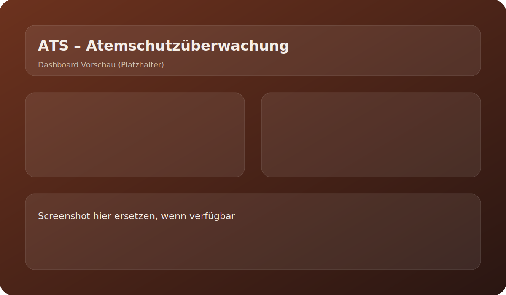

# Atemschutzueberwachung

Webanwendung zur einfachen Atemschutzüberwachung für die Feuerwehr.

## Projektstruktur

- `backend/` ASP.NET Core API (C#) mit SQLite
- `frontend/` Angular App
- `docs/` Projekt- und API-Dokumentation

## Features

- Einsatz- und Truppverwaltung mit Live-Status
- Druckmessungen mit Validierung (keine höheren Werte als Start-/Letzte Messung)
- CSV-Import für Atemschutzgeräteträger
- Excel-Export (XLSX) pro Einsatz
- Live-Updates via SignalR
- Mehrere Organisationen (Admin/User)

## Auth & Organisationen

- Login per Organisationscode + PIN
- Hersteller-Portal: `/admin-login` (System-Secret)
- Admin kann Stammdaten und Standardwerte verwalten

## Standardwerte

Im Einstellungsbereich können Default-Werte für neue Trupps gepflegt werden:
- Startdruck Person 1/2
- Warnzeit
- Maxzeit

## Lokale Entwicklung

### Backend

```powershell
cd backend
$env:SYSTEM_SECRET="DEIN_SECRET"
dotnet run
```

### Frontend

```powershell
cd frontend
npm install
npm run start
```

## Quickstart

1. Backend starten (Port 5114)
2. Frontend starten (Port 4200)
3. Öffnen: `http://localhost:4200`
4. Mit Orga-Code + PIN einloggen

## Screenshot



## Hinweise

- Die API läuft standardmäßig auf `http://localhost:5114`
- Die Angular App erwartet das Backend auf `http://localhost:5114`
