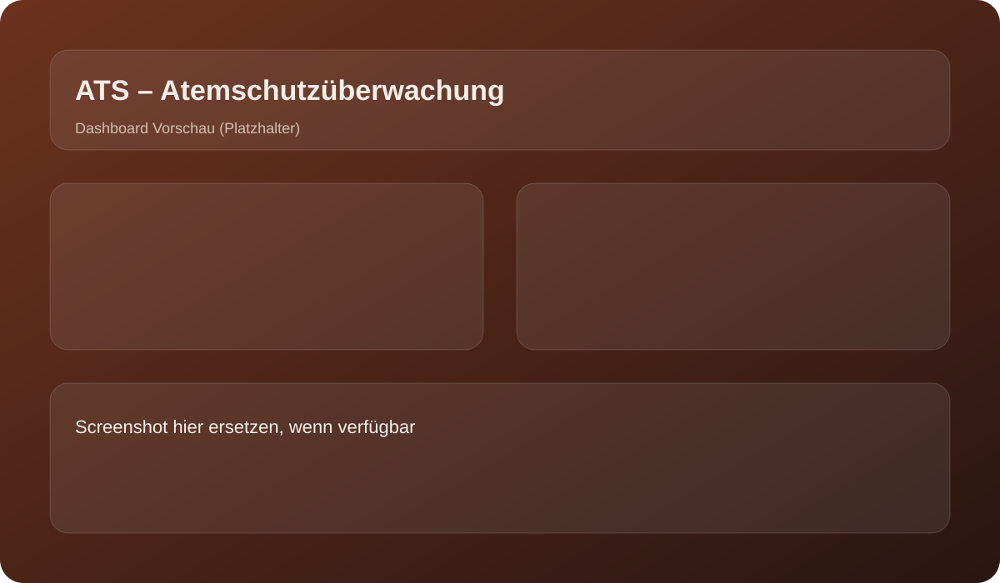

# Atemschutzueberwachung

Webanwendung zur einfachen Atemschutzüberwachung für die Feuerwehr.

## Projektstruktur

- `backend/` ASP.NET Core API (C#) mit SQLite
- `frontend/` Angular App
- `docs/` Projekt- und API-Dokumentation

## Features

- Einsatz- und Truppverwaltung mit Live-Status
- Druckmessungen mit Validierung (keine höheren Werte als Start-/Letzte Messung)
- CSV-Import für Atemschutzgeräteträger
- Excel-Export (XLSX) pro Einsatz
- Live-Updates via SignalR
- Mehrere Organisationen (Admin/User)

## Auth & Organisationen

- Login per Organisationscode + PIN
- Hersteller-Portal: `/admin-login` (System-Secret)
- Admin kann Stammdaten und Standardwerte verwalten
- Sessions: 12 h für Organisationen, 30 min für das Hersteller-Portal. In der Datenbank liegt nur ein SHA-256-Hash der Tokens.
- Eine neue PIN beendet alle Sessions dieser Rolle; eine gesperrte Organisation verliert alle Sessions sofort.

## Betrieb / Deployment

| Variable | Pflicht | Bedeutung |
| --- | --- | --- |
| `SYSTEM_SECRET` | ja | Secret für das Hersteller-Portal, mind. 16 Zeichen |
| `CORS_ORIGINS` | nein | Erlaubte Frontend-Origins, kommagetrennt (Standard `http://localhost:4200`); nur nötig, wenn Frontend und API auf unterschiedlichen Domains laufen |
| `LEGACY_TIMEZONE` | nein | Zeitzone alter Datenbanken für die einmalige UTC-Umrechnung (Standard `Europe/Berlin`) |

- Außerhalb von `Development` erzwingt das Backend HTTPS (Redirect + HSTS); Swagger ist dort deaktiviert.
- Die API setzt Sicherheits-Header (u. a. `X-Frame-Options: DENY`, `nosniff`, restriktive CSP, `Cache-Control: no-store`).
- Das Frontend bringt eine Content-Security-Policy per `<meta>`-Tag mit und lädt nur eigene Ressourcen (Schrift ist lokal eingebunden, kein Google Fonts). Der Webserver, der das Frontend ausliefert, sollte zusätzlich `Content-Security-Policy: frame-ancestors 'none'` und `X-Frame-Options: DENY` setzen, da `frame-ancestors` im `<meta>`-Tag nicht wirkt.
- Läuft das Backend hinter einem Reverse Proxy auf einem anderen Host, müssen dessen Adressen für `X-Forwarded-For` konfiguriert werden, sonst greifen Login-Sperre und Rate-Limit pro Proxy statt pro Client.

## Standardwerte

Im Einstellungsbereich können Default-Werte für neue Trupps gepflegt werden:
- Startdruck Person 1/2
- Warnzeit
- Maxzeit

## Lokale Entwicklung

### Backend

```powershell
cd backend
$env:SYSTEM_SECRET="MINDESTENS-16-ZEICHEN-LANG"
dotnet run
```

- `SYSTEM_SECRET` ist Pflicht (mind. 16 Zeichen), sonst startet das Backend nicht. Niemals ins Repository schreiben.
- Beim ersten Start wird eine Demo-Organisation mit **zufälligen** Initial-PINs angelegt; Code und PINs stehen einmalig in der Konsolenausgabe (`[BOOTSTRAP]`).
- Neue bzw. zurückgesetzte PINs müssen mindestens 6 Zeichen haben; Admin- und Benutzer-PIN müssen sich unterscheiden.
- Die Datenbank `backend/data/ats.db` ist nicht Teil des Repositorys (enthält personenbezogene Daten).
- Alle Zeitstempel werden in UTC gespeichert. Ältere Datenbanken werden beim ersten Start einmalig umgerechnet; die frühere Zeitzone lässt sich über `LEGACY_TIMEZONE` setzen (Standard: `Europe/Berlin`).
- Login-Schutz: max. 20 Login-Anfragen pro Minute und IP; nach 10 Fehlversuchen wird die Kombination aus IP und Orga-Code für 15 Minuten gesperrt.

### Frontend

```powershell
cd frontend
npm install
npm run start
```

## Quickstart

1. Backend starten (Port 5114)
2. Frontend starten (Port 4200)
3. Öffnen: `http://localhost:4200`
4. Mit Orga-Code + PIN einloggen (siehe `[BOOTSTRAP]`-Ausgabe beim ersten Start)

## Screenshot



## Hinweise

- Die API läuft standardmäßig auf `http://localhost:5114`
- Die Angular App erwartet das Backend auf `http://localhost:5114`
